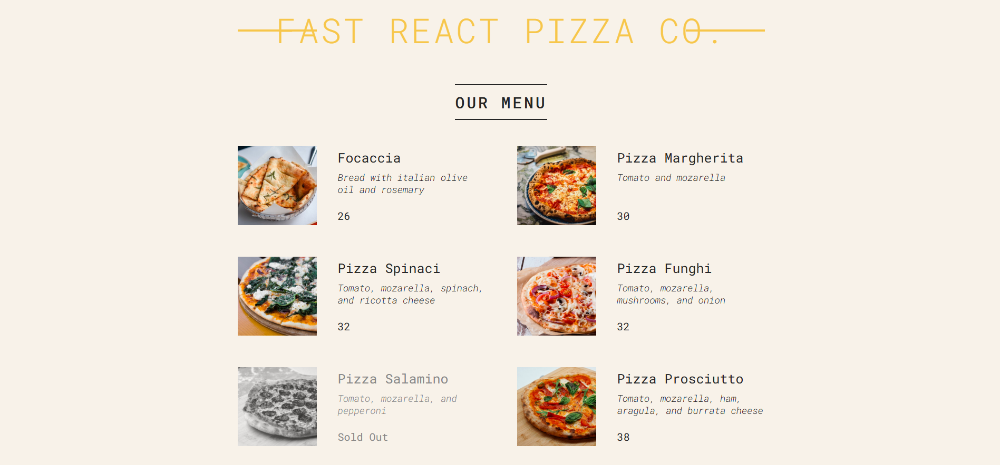

## 🍕 React Pizza Menu App
This is a simple React-based Pizza Menu application that dynamically displays a list of available pizzas along with their details such as name, ingredients, price, and availability status.

## ✅ Features:
Displays a list of pizzas using a clean and modular component structure.

Each pizza card shows:

🍕 Pizza name

🧾 Description (ingredients)

💵 Price

❌ Marks as "Sold Out" if unavailable

A footer that tells the user if the pizza shop is currently open or closed based on the system's time.

⏰ Displays dynamic message like "We're currently open! Come visit or order online."

🚫 Or shows "Sorry, we're closed. Please visit us during business hours."

## 🖼️ UI Overview

## 🛠️ Tech Stack

- **REACTJS**
- **HTML**
- **CSS**
- **JAVASCRIPT**

## 🚀 Live Demo

## 📄 License

MIT License

Copyright (c) 2025 Tejas

Open source under the 
